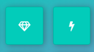

# Fend-Memory-Game 

A Browser-based Card Matching Game, rely on JavaScript without any external libraries! Start by clicking on a Card and you will see an Image, try to search for it in the other cards!

*Project #3 Udacity Front-End Nanodegree Memory Matching Game*

## How To Play?

*  Open The [Live Preview](https://bosa-game.netlify.com/)

*  Click on Any Card And You Will See a Symbol.

*  Keep Searching for This Symbol's Peer in Other Cards.

*  When You Find The Right One, Both Of Them Will Stay Flipped.

*  If You Didn't Find It, Both Of Them Will Be Flipped back/Invisible Again.

                > Try to find the peers in as less moves as possible to get a better rating!

  *So, you gotta have a good memory!*
 
 
 ## Features
 
*  Count your moves.
*  Live Stopwatch.
*  Rating System [ Based on your Moves! ]
*  Retry/Restart the game button.

## Demo

###  [PLAY NOW!](https://bosa-game.netlify.com/)

## Contributing:
*Base CSS classes for styling were provided by Udacity as a _starter_ code. part of Udacity Front-End Nanodegree projects (3 of 9).*

